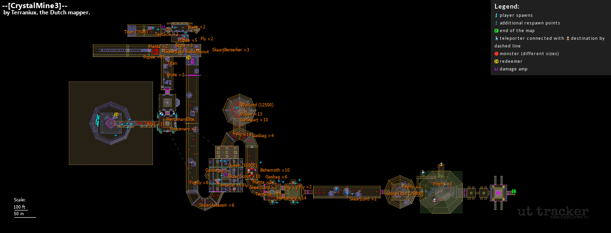
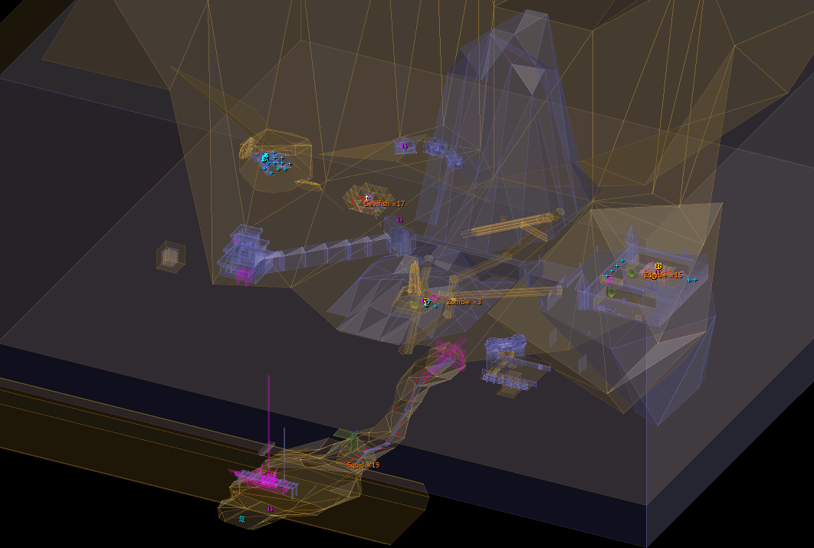

# UnrealPOI

Toolchain for generating Point-of-interests maps of Unreal Tournament levels.

It can obtain almost every UT level made in the past 25 years, by
searching for download links in various sources.



## Requirements
- [Python](https://www.python.org/downloads/) 3.10+ with venv
- [PHP](https://www.php.net/downloads.php) 8.2+
- [Composer](https://getcomposer.org/)
- Git
- Unreal Tournament installation with `UCC.exe` or `ucc-bin` ([OldUnreal](https://www.oldunreal.com/downloads/unrealtournament/full-game-installers/))
- [7-zip](https://www.7-zip.org/download.html) (recommended)

## Setup
Rename `config.yaml.dist` file to `config.yaml`. Edit the configuration file,
pointing to folder with Unreal Tournament:
```yaml
# examples:
main: "C:\\games\\UnrealTournament\\"  # Windows
main: "/mnt/sda/UnrealTournament"      # Linux
```

In the cloned directory, run:
```sh
python -m venv .venv
.venv/Scripts/activate
python -m pip install pyyaml pyquery patool aiohttp
composer install --working-dir "./renderer/unrealpoi-php"
```

## Usage
UnrealPOI runs as a continuous process, which is launched by:
```sh
.venv/Scripts/activate
python .
```
On the first run, the app is going to create a local index of
levels available for download. The data is fetched from
[Unreal Archive](https://unrealarchive.org/)'s Git repository,
and might take up to 20 minutes to process. 

An HTTP server is started on the port 39801. The app is ready
to take requests for generating maps.

The server provides a single endpoint:

```
POST /download
```
The request body consists of a JSON object, containing name of the
level to be processed:
```json
{"map": "CTF-Face"}
```

If the request was successful, a 200 OK response is returned instantly:
```json
{"status": "Download request successful"}
```
The level is added to the queue, and will be processed in the background.

All the products of the generation will be available in directory
**Storage/MapContent/(name_of_level)**, unless configured otherwise.

